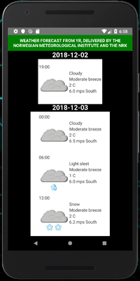

# Awsome w34th3r app

## Quickstart

### Pre requirements  
 * install nodejs https://nodejs.org/en/
```bash
npm install -g react-native-cli
```
 * install android studio https://developer.android.com/studio/
 * install android 8.1 (Oreo) sdk
 * create an emulated device running Android 8.1

 * run the app
```bash
npm install
npm start
```
* start an emulated Android device or run in on a real phone
```bash
react-native run-android
```

 * run unit tests
```bash
npm test
```

### Todos
- [ ] add JSLint
- [ ] improve xml validation
- [ ] create an awsome design for the ui